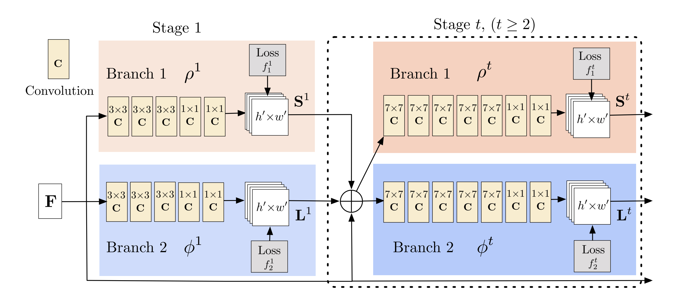

# Diaper Size analysis
Submission for **Hacking the diaper** hackathon by Kimberly-Clark 
Team : Team Big Brain
## Problem statement
Based on a recent “fit” study, almost one-third of diaper users wear the wrong diaper size, while four out of ten mothers state that diaper fit is a significant concern at every stage of diapering. Despite disposable diapers being around for the last half-century, ensuring proper fit of diapers for babies can be confusing for parents. When babies wear the wrong diaper size, the chances of leakage and blowouts increase. Kimberly-Clark continues to partner with parents to not just provide a diaper that fits their baby perfectly, but also provide the technology and tools needed to reduce diaper fit challenges. 
## Objective
This project is aimed to provide a reliable solution for the parents to for the correct diaper size and predict change of diaper size upon future based on our AI/ML algorithm and AR technology.
## Our solution
use of convolution to detect keypoints:
Branch 1 : S represents the set of keypoints
Branch 2 : L represents the affinity vectors

## references
https://github.com/CMU-Perceptual-Computing-Lab/openpose
