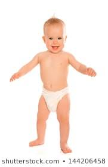
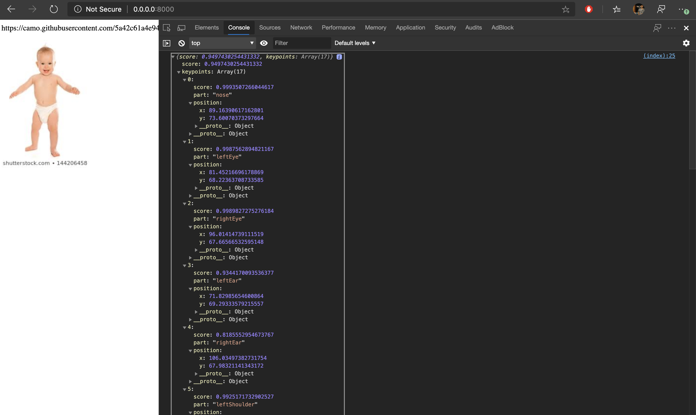
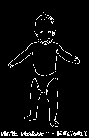
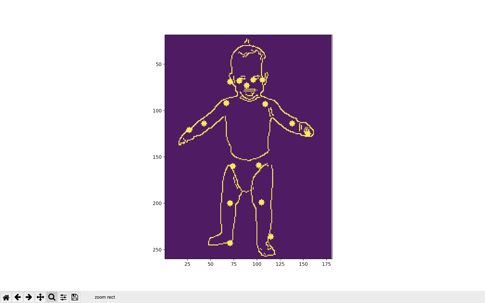
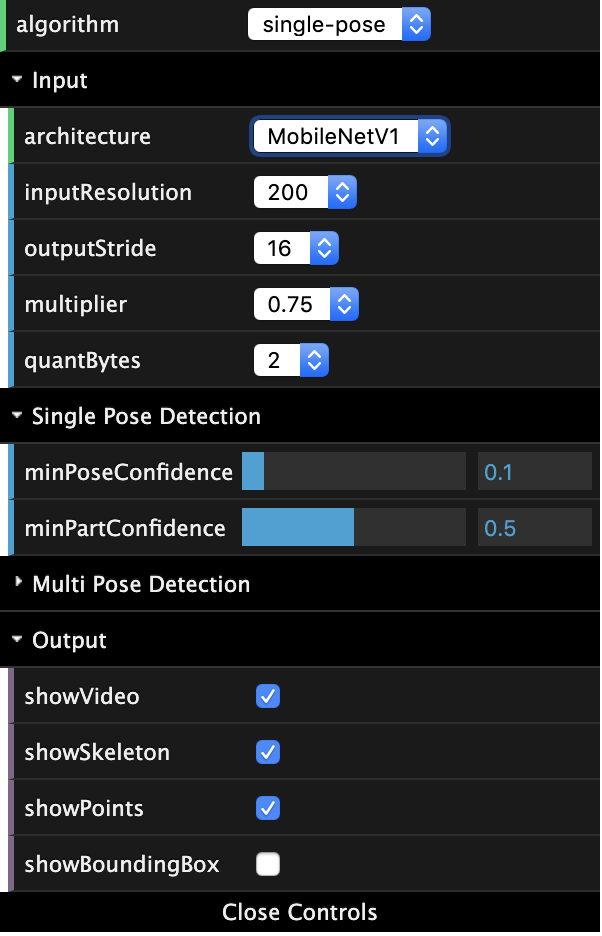
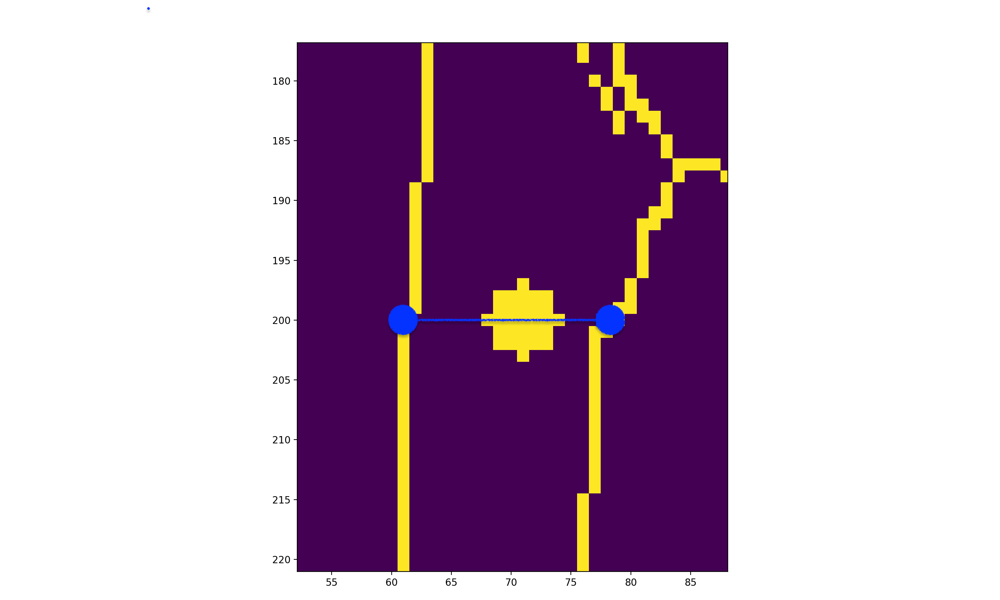

# AR and Deep Learning based Automatic Human Body Measurement System
Submission for **Hacking the diaper** hackathon by Kimberly-Clark<br>
Team : Team Big Brain
## Problem statement
Based on a recent “fit” study, almost one-third of diaper users wear the wrong diaper size, while four out of ten mothers state that diaper fit is a significant concern at every stage of diapering. Despite disposable diapers being around for the last half-century, ensuring proper fit of diapers for babies can be confusing for parents. When babies wear the wrong diaper size, the chances of leakage and blowouts increase. Kimberly-Clark continues to partner with parents to not just provide a diaper that fits their baby perfectly, but also provide the technology and tools needed to reduce diaper fit challenges.<br>
## Objective
This project is aimed to provide a reliable solution for the parents to know the correct baby's body measurements to get right size diaper and clothing and get future size prediction.
## Solution:
This projects presents an unique body measurement system based on AR and ML technology.<br>
AR measurement is taken using ARKit and/or ARCore technology to measure distance between two key-points on the body.<br>
Keypoints are detected on an remote side server from ML based pose estimation and edge keypoint recognition. These keypoints are send back to the server side device and measurements are taken.<br>
### Body Measurements
1. Height
2. Head circumference
3. Waist circumference
4. Mid-arm circumference
5. Upper arm length
6. Subscapular skinfold thickness
7. Triceps skinfold thickness
8. Calf circumference
9. Upper leg length
10. Mid-thigh circumference
 
### Installation

You can use this as standalone es5 bundle like this:

```html
  <script src="https://cdn.jsdelivr.net/npm/@tensorflow/tfjs"></script>
  <script src="https://cdn.jsdelivr.net/npm/@tensorflow-models/posenet"></script>
```

Or you can install it via npm for use in a TypeScript / ES6 project.

```sh
npm install @tensorflow-models/posenet
```

#### WHY TENSORFLOW.JS ?
We're using tensorflow.js for machine learning on web server.<br>
ML used to require lots of time and money to get started
Configurations, dependencies, hardware costs, lots of headaches
But now anyone can train and test ML models in the browser really easily using Tensorflow.js
Even python was more difficult (jupyter notebooks, numpy, scikit, pandas, etc)
ML in the browser means 
##### Privacy - Data is local, none leaves the clients device. Much safer. 
##### Wide distribution - JavaScript has one of the widest install bases of any language and framework. 
##### Distributed Computing - Leverage client side data from many users to help train a model
We've used Layer APIs for easier implementaion.<br>

### PoseNet
PoseNet can be used to estimate either a single pose or multiple poses. The single person pose detector is faster and simpler but requires only one subject present in the image (more on that later)<br>
**For body measurement, we'll be using single pose estimation as we need to measure only a single body at a time.**<br>
At a high level pose estimation happens in two phases:<br>
**First**, An input RGB image is fed through a convolutional neural network.<br>
Either a single-pose or multi-pose decoding algorithm is used to decode poses, pose confidence scores, keypoint positions, and keypoint confidence scores from the model outputs <br>
PoseNet will return a pose object that contains a list of keypoints and an instance-level confidence score for each detected person.<br>
A Keypoint Position is 2-D x and y coordinates in the original input image where a keypoint has been detected.
### PoseNet currently detects 17 keypoints :
All keypoints are indexed by part id.  The parts and their ids are:<br>

| Id | Part |
| -- | -- |
| 0 | nose |
| 1 | leftEye |
| 2 | rightEye |
| 3 | leftEar |
| 4 | rightEar |
| 5 | leftShoulder |
| 6 | rightShoulder |
| 7 | leftElbow |
| 8 | rightElbow |
| 9 | leftWrist |
| 10 | rightWrist |
| 11 | leftHip |
| 12 | rightHip |
| 13 | leftKnee |
| 14 | rightKnee |
| 15 | leftAnkle |
| 16 | rightAnkle |

## Usage
This project uses a standalone model called PoseNet, for running real-time pose estimation in the browser using TensorFlow.js which can be run on a back-end web server.<br>
Using posenet, a single pose or multiple poses can be estimated from an image. **We will be using single person pose estimation as it will be faster, require less processing and we need measurement of only a single person at one time.**
<br>
A lot of developers are using pretrained models because it is very easy to use and implement. Transfer learning is a huge use case for tensorflowjs. We can use pre-trained models and easily implement in tensorflow js.
**Since we did not have image dataset of baby pictures, we've used general human body dataset.<br>
This model will work on most baby images but it won't on some of the images. We need baby images dataset which shall be trained and imported in our model. Though, it is very easy to train a model and implement in tensorflow.js.
Process for loading a pretrained model is given.**

### Single-Person Pose Estimation
Single pose estimation is the simpler and faster of the two algorithms. Its ideal use case is for when there is only one person in the image. The disadvantage is that if there are multiple persons in an image, keypoints from both persons will likely be estimated as being part of the same single pose—meaning, for example, that person #1’s left arm and person #2’s right knee might be conflated by the algorithm as belonging to the same pose. Both the MobileNetV1 and the ResNet architecture support single-person pose estimation. The method returns a **single pose**:

```javascript
const net = await posenet.load();

const pose = await net.estimateSinglePose(image, {
  flipHorizontal: false
});
```
#### Params in estimateSinglePose()

* **image** - ImageData|HTMLImageElement|HTMLCanvasElement|HTMLVideoElement
   The input image to feed through the network.
* **inferenceConfig** - an object containing:
  * **flipHorizontal** - Defaults to false.  If the pose should be flipped/mirrored  horizontally.  This should be set to true for videos where the video is by default flipped horizontally (i.e. a webcam), and you want the poses to be returned in the proper orientation.

#### Returns

It returns a `Promise` that resolves with a  **single** `pose`. The `pose` has a confidence score and an array of keypoints indexed by part id, each with a score and position.

#### Usage

##### via Script Tag

```html
<html>
  <head>
    <!-- Load TensorFlow.js -->
    <script src="https://cdn.jsdelivr.net/npm/@tensorflow/tfjs"></script>
    <!-- Load Posenet -->
    <script src="https://cdn.jsdelivr.net/npm/@tensorflow-models/posenet"></script>
 </head>

  <body>
    
  </body>
  <!-- Place your code in the script tag below. You can also use an external .js file -->
  <script>
    var flipHorizontal = false;

    var imageElement = document.getElementById('cat');

    posenet.load().then(function(net) {
      const pose = net.estimateSinglePose(imageElement, {
        flipHorizontal: true
      });
      return pose;
    }).then(function(pose){
      console.log(pose);
    })
  </script>
</html>
```

###### via NPM

```javascript
import * as posenet from '@tensorflow-models/posenet';

async function estimatePoseOnImage(imageElement) {
  // load the posenet model from a checkpoint
  const net = await posenet.load();

  const pose = await net.estimateSinglePose(imageElement, {
    flipHorizontal: false
  });
  return pose;
}

const imageElement = document.getElementById('cat');

const pose = estimatePoseOnImage(imageElement);

console.log(pose);

```

## Demo
This package contains running real time pose estimation in any browser using Tensorflow.js:<br>
[Try the demo here!](https://storage.googleapis.com/tfjs-models/demos/posenet/camera.html)
### Example
<br>
- To get single pose estimation, run the following script:<br>
```
python -m http-server 8000
```
- Open http://0.0.0.0:8000/ in your browser <br>
- Read the result from Console log <br>
- **Result from SINGLE POSE ESTIMATION**

```
{
"score": 0.9497430254431332,
"keypoints": [
{
"score": 0.9993507266044617,
"part": "nose",
"position": {
"x": 89.16390617162801,
"y": 73.60070373297664,
}
},
{
"score": 0.998756289482116,
"part": "leftEye",
"position": {
"x": 81.45216696178869,
"y": 68.22363708733585,
}
},
{
"score": 0.9989827275276184,
"part": "rightEye",
"position": {
"x": 96.01414739111519,
"y": 67.66566532595148,
}
},
{
"score": 0.9344170093536377,
"part": "leftEar",
"position": {
"x": 71.82985654600864,
"y": 69.29333579215557,
}
},
{
"score": 0.8185552954673767,
"part": "rightEar",
"position": {
"x": 106.03497382731754,
"y": 67.98321141343172,
}
},
{
"score": 0.9925171732902527,
"part": "leftShoulder",
"position": {
"x": 67.96828944581029,
"y": 92.67281142654122,
}
},
{
"score": 0.995404839515686,
"part": "rightShoulder",
"position": {
"x": 109.76879357363929,
"y": 93.22251256801738,
}
},
{
"score": 0.9309068322181702,
"part": "leftElbow",
"position": {
"x": 43.98161743401556,
"y": 114.15831925804048,
}
},
{
"score": 0.8832974433898926,
"part": "rightElbow",
"position": {
"x": 138.69028897415342,
"y": 114.38970543531127,
}
},
{
"score": 0.8918079733848572,
"part": "leftWrist",
"position": {
"x": 27.378865935923073,
"y": 121.017256562348,
}
},
{
"score": 0.9662160873413086,
"part": "rightWrist",
"position": {
"x": 155.04230897064804,
"y": 125.30266787755349,
}
},
{
"score": 0.9975414276123047,
"part": "leftHip",
"position": {
"x": 74.92388844768362,
"y": 160.69435446178866,
}
},
{
"score": 0.9967007040977478,
"part": "rightHip",
"position": {
"x": 102.59964277215506,
"y": 159.6582078748176,
}
},
{
"score": 0.967958927154541,
"part": "leftKnee",
"position": {
"x": 71.08008952456228,
"y": 200.92868433852138,
}
},
{
"score": 0.9682652950286865,
"part": "rightKnee",
"position": {
"x": 105.99922892648424,
"y": 199.09481775899803,
}
},
{
"score": 0.8711856603622437,
"part": "leftAnkle",
"position": {
"x": 71.58785897934021,
"y": 243.5953744376216,
}
},
{
"score": 0.9337670207023621,
"part": "rightAnkle",
"position": {
"x": 115.09406639722536,
"y": 236.8689249832806,
}
}]
}
```
### Contour detection
 | 
Instructions to use : 
##  POSE ESTIMATION OVER CONTOUR

#### Config params in posenet.load()

 * **architecture** - Can be either `MobileNetV1` or `ResNet50`. It determines which PoseNet architecture to load.

 * **outputStride** - Can be one of `8`, `16`, `32` (Stride `16`, `32` are supported for the ResNet architecture and stride `8`, `16`, `32` are supported for the MobileNetV1 architecture). It specifies the output stride of the PoseNet model. The smaller the value, the larger the output resolution, and more accurate the model at the cost of speed. Set this to a larger value to increase speed at the cost of accuracy.

* **inputResolution** - A `number` or an `Object` of type `{width: number, height: number}`. Defaults to `257.` It specifies the size the image is resized and padded to before it is fed into the PoseNet model. The larger the value, the more accurate the model at the cost of speed. Set this to a smaller value to increase speed at the cost of accuracy. If a number is provided, the image will be resized and padded to be a square with the same width and height.  If `width` and `height` are provided, the image will be resized and padded to the specified width and height.

 * **multiplier** - Can be one of `1.01`, `1.0`, `0.75`, or `0.50` (The value is used *only* by the MobileNetV1 architecture and not by the ResNet architecture). It is the float multiplier for the depth (number of channels) for all convolution ops. The larger the value, the larger the size of the layers, and more accurate the model at the cost of speed. Set this to a smaller value to increase speed at the cost of accuracy.

 * **quantBytes** - This argument controls the bytes used for weight quantization. The available options are:

   - `4`. 4 bytes per float (no quantization). Leads to highest accuracy and original model size (~90MB).

   - `2`. 2 bytes per float. Leads to slightly lower accuracy and 2x model size reduction (~45MB).
   - `1`. 1 byte per float. Leads to lower accuracy and 4x model size reduction (~22MB).

* **modelUrl** - An optional string that specifies custom url of the model. This is useful for local development or countries that don't have access to the model hosted on GCP.


#### NOTE
**By default,** PoseNet loads a MobileNetV1 architecture with a **`0.75`** multiplier.  This is recommended for computers with **mid-range/lower-end GPUs.**  A model with a **`0.50`** multiplier is recommended for **mobile.** The ResNet achitecture is recommended for computers with **even more powerful GPUs**.

## Edge Keypoint recognition:
- This projects present an unique edge keypoint recognition based on the resultant keypoints from single pose estimation method. This edge keypoints will be required for getting end-to-end body measurements of the baby.
- In this method, we will be moving those keypoints on the edge of the body. We will be working with the contour detected image.


In the above demostration, there are two steps involved in the algorithm<br>
- Location of the pose keypoint is known, based on that **nearest detected contour** is calculated. Nearest contour is marked as one keypoint and 
- For another keypoint, a vector in the opposite angle to the current vector is marked and contour detected on that vector will be the second keypoint.<br>
- These two keypoints will be required to measure the thigh length.
## Smartphone app
### iOS app
demo: https://youtu.be/IbV_1hZTjYY

### Android app
demo: https://youtu.be/oZ6-cmX-Xk0
### Resultant keypoints from edge keypoint detection algorithm will be send to the user's smartphone app and the distance between the keypoints shall be measured automatically using AR technology. 
### User needs to capture image of the baby by keeping it against a plane surface (such as a wall) as AR measurements are only for plane surfaces.
### User need to give two poses seperately:
- Front pose and
- Side pose
Based on the two poses, accurate measurements will be taken
## Why not client-side processing?
Images are captured on the client side device of the user and send on to our server where the analysis and processing is done.
The processing required for pose estimation is fairly complicated and require processing power. All devices are not capable of such high processing so remote side processing is better.
 
## References
1. https://github.com/CMU-Perceptual-Computing-Lab/openpose 
2. Realtime Multi-Person 2D Pose Estimation using Part Affinity Fields: Zhe Cao Tomas Simon Shih-En Wei Yaser Sheikh: The Robotics Institute, Carnegie Mellon University<br>https://arxiv.org/pdf/1611.08050.pdf
3. https://www.youtube.com/watch?v=Nc8kZABv-KE
4. TFJS Docs https://js.tensorflow.org/tutorials/core-concepts.html
5. Shiffmans series https://www.youtube.com/watch?v=Qt3ZABW5lD0
