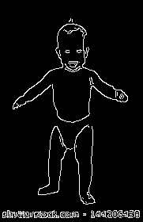

# Instructions to use
## Taking Coordinates from Single Pose estimation
```
{
"score": 0.9497430254431332,
"keypoints": [
{
"score": 0.9993507266044617,
"part": "nose",
"position": {
"x": 89.16390617162801,
"y": 73.60070373297664,
}
}
,
{
"score": 0.998756289482116,
"part": "leftEye",
"position": {
"x": 81.45216696178869,
"y": 68.22363708733585,
}
}
,
{
"score": 0.9989827275276184,
"part": "rightEye",
"position": {
"x": 96.01414739111519,
"y": 67.66566532595148,
}
}
,
{
"score": 0.9344170093536377,
"part": "leftEar",
"position": {
"x": 71.82985654600864,
"y": 69.29333579215557,
}
}
,
{
"score": 0.8185552954673767,
"part": "rightEar",
"position": {
"x": 106.03497382731754,
"y": 67.98321141343172,
}
}
,
{
"score": 0.9925171732902527,
"part": "leftShoulder",
"position": {
"x": 67.96828944581029,
"y": 92.67281142654122,
}
}
,
{
"score": 0.995404839515686,
"part": "rightShoulder",
"position": {
"x": 109.76879357363929,
"y": 93.22251256801738,
}
}
,
{
"score": 0.9309068322181702,
"part": "leftElbow",
"position": {
"x": 43.98161743401556,
"y": 114.15831925804048,
}
}
,
{
"score": 0.8832974433898926,
"part": "rightElbow",
"position": {
"x": 138.69028897415342,
"y": 114.38970543531127,
}
}
,
{
"score": 0.8918079733848572,
"part": "leftWrist",
"position": {
"x": 27.378865935923073,
"y": 121.017256562348,
}
}
,
{
"score": 0.9662160873413086,
"part": "rightWrist",
"position": {
"x": 155.04230897064804,
"y": 125.30266787755349,
}
}
,
{
"score": 0.9975414276123047,
"part": "leftHip",
"position": {
"x": 74.92388844768362,
"y": 160.69435446178866,
}
}
,
{
"score": 0.9967007040977478,
"part": "rightHip",
"position": {
"x": 102.59964277215506,
"y": 159.6582078748176,
}
}
,
{
"score": 0.967958927154541,
"part": "leftKnee",
"position": {
"x": 71.08008952456228,
"y": 200.92868433852138,
}
}
,
{
"score": 0.9682652950286865,
"part": "rightKnee",
"position": {
"x": 105.99922892648424,
"y": 199.09481775899803,
}
}
,
{
"score": 0.8711856603622437,
"part": "leftAnkle",
"position": {
"x": 71.58785897934021,
"y": 243.5953744376216,
}
}
,
{
"score": 0.9337670207023621,
"part": "rightAnkle",
"position": {
"x": 115.09406639722536,
"y": 236.8689249832806,
}
}]
}
```
## Image Thresholding & Contour Detection
- Loading the image
```
img = cv2.imread('../assets/baby.jpeg')
gray = cv2.cvtColor(img, cv2.COLOR_BGR2GRAY)
```
- Thresholding
```
flag, thresh = cv2.threshold(gray, 120, 255, cv2.THRESH_BINARY)
```
- Finding and drawing Contours
```
img2, contours, hierarchy = cv2.findContours(thresh, cv2.RETR_TREE, cv2.CHAIN_APPROX_SIMPLE)
contours = sorted(contours, key=cv2.contourArea, reverse=True) 
```
- Selecting long perimeters only
```
perimeters = [cv2.arcLength(contours[i],True) for i in range(len(contours))]
listindex=[i for i in range(15) if perimeters[i]>perimeters[0]/2]
numcards=len(listindex)

card_number = -1 #just so happened that this is the worst case
stencil = np.zeros(img.shape).astype(img.dtype)
cv2.drawContours(stencil, [contours[listindex[card_number]]], 0, (255, 255, 255), cv2.FILLED)
res = cv2.bitwise_and(img, stencil)
canny = cv2.Canny(res, 100, 200)
```
Run the following script to see the result
```
python thresholding.py
```
 | 

## Estimated pose over contour
Run the following script
```
python thres.py
```
Result:<br>

